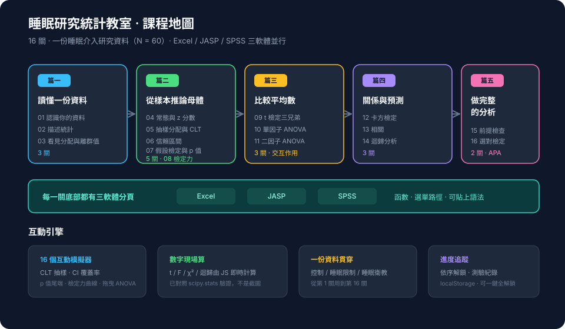

# 睡眠研究統計教室

十六關的互動式統計學課程。用同一份睡眠介入研究的資料（N = 60），同時教 **Excel**、**JASP**、**SPSS** 三套軟體，從「這一欄是什麼」一路到「把結果寫成 APA 第七版的句子」。

[]()
[]()
[]()

**[→ 打開線上版](https://yu-0312.github.io/stat-lab/)**

<p align="center">
  
</p>

---

## 特色

- **一份資料貫穿全課** — 三組睡眠介入（控制／睡眠限制／睡眠衛教），變項包含睡眠時數、手機使用、焦慮前後測、記憶測驗分數、性別。
- **所有數字都是現場算的** — t 檢定、ANOVA、卡方、相關、迴歸的「軟體輸出報表」都由頁面內的 JavaScript 統計引擎即時計算，不是截圖。引擎的 t / F / χ² 分配、迴歸與二因子 ANOVA 均已對照 Python `scipy.stats` 驗證。
- **16 個互動模擬器** — 中央極限定理抽樣、信賴區間覆蓋率、p 值尾端面積、檢定力曲線、拖曳式 ANOVA 與交互作用圖、可編輯的列聯表、猜 r 小遊戲、手動拉迴歸線比 SSE、Q-Q 圖診斷、選檢定決策樹。
- **三軟體並排** — 每一關底部都有 Excel／JASP／SPSS 分頁，給齊函數、選單路徑與可直接貼上的 SPSS 語法。
- **進度追蹤** — 關卡依序解鎖，測驗紀錄與進度存在瀏覽器的 `localStorage`（也可以一鍵解鎖全部關卡）。

---

## 課程架構

| 篇 | 關卡 |
|---|---|
| **第一篇　讀懂一份資料** | 01 認識你的資料　02 描述統計：中心與散布　03 看見分配：圖形與離群值 |
| **第二篇　從樣本推論母體** | 04 常態分配與 z 分數　05 抽樣分配與中央極限定理　06 信賴區間　07 假設檢定的邏輯與 p 值　08 效果量與統計檢定力 |
| **第三篇　比較平均數** | 09 t 檢定三兄弟　10 單因子變異數分析　11 二因子變異數分析與交互作用 |
| **第四篇　關係與預測** | 12 卡方檢定　13 相關　14 迴歸分析 |
| **第五篇　做完整的分析** | 15 前提檢查與無母數替代　16 選對檢定，寫成報告 |

---

## 本地執行

單一 HTML 檔，沒有建置流程、沒有相依套件。

```bash
open index.html          # macOS
# 或起一個本機伺服器
python3 -m http.server 8000
```

唯一的外部資源是 Google Fonts（IBM Plex 與 Noto Sans/Serif TC）；離線時會自動退回系統字型。

---

## 技術說明

| 項目 | 內容 |
|---|---|
| 檔案 | 單一 `index.html`，約 240 KB，所有 CSS / JS / 資料皆內嵌 |
| 繪圖 | 原生 Canvas 2D，支援 devicePixelRatio 與深淺色主題切換 |
| 統計 | 自行實作：不完全 beta／gamma 函數、常態／t／F／χ² 的 PDF 與 CDF、t 檢定、單因子與二因子 ANOVA、Levene、卡方、Pearson／Spearman、多元迴歸、檢定力近似 |
| 主題 | 依 `prefers-color-scheme` 自動切換深淺色 |
| 響應式 | 桌機為側欄版面，窄螢幕（≤ 860px）改為抽屜式導覽 |

---

## 授權

教材內容與程式碼皆可自由使用與修改。資料集為模擬產生，非真實受試者資料。
